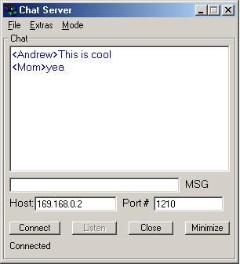



## Fully Featured Chat Program

### Description

Fully loaded chat program. Uses winsock control. Can save and print chat session. Can start with windows using the registry. Sound clip upin incoming message and window comes to front of screen. Can change color of text. Single client/server in one exe file. Has auto update feature and retrieves newwest version if there is one. File transfer and ping.
 
### More Info
 

             |
---                |---
**Submitted On**   |2001-03-30 21:17:22
**By**             |[Andrew Parisio](https://github.com/Planet-Source-Code/PSCIndex/blob/master/ByAuthor/andrew-parisio.md)
**Level**          |Intermediate
**User Rating**    |4.5 (27 globes from 6 users)
**Compatibility**  |VB 5\.0, VB 6\.0
**Category**       |[Miscellaneous](https://github.com/Planet-Source-Code/PSCIndex/blob/master/ByCategory/miscellaneous__1-1.md)
**World**          |[Visual Basic](https://github.com/Planet-Source-Code/PSCIndex/blob/master/ByWorld/visual-basic.md)
**Archive File**   |[Fully Feat177593312001\.zip](https://github.com/Planet-Source-Code/andrew-parisio-fully-featured-chat-program__1-22051/archive/master.zip)

